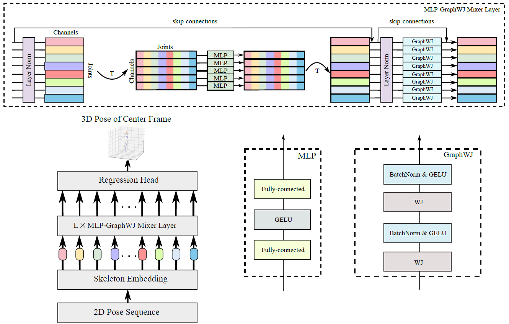

# Spatio-Temporal MLP-Graph Network for 3D Human Pose Estimation
<p align="center"></p>
The PyTorch implementation for MLP-Graph.

## Qualitative and quantitative results
<p align="center"></p>

| Method | MPJPE(mm) | PA-MPJPE(mm) | Infer. Time
|  :----:  | :----: | :----: | :----: | 
| [SemGCN](https://github.com/garyzhao/SemGCN) | 40.78 | 31.46 | .012s |
| [High-order GCN](https://github.com/ZhimingZo/HGCN) | 39.52 | 31.07 | .013s |
| [Weight Unsharing](https://github.com/tamasino52/Any-GCN) | 37.83 | 30.09 | 0.32s |
| [ModulatedGCN](https://github.com/ZhimingZo/Modulated-GCN) | 37.43 | 29.73 | 0.08s |
| Ours | **36.34* | **28.97** | **0.05s** |

## Dependencies

Make sure you have the following dependencies installed:

* PyTorch >= 1.7.0
* NumPy
* Matplotlib
* FFmpeg (if you want to export MP4 videos)
* ImageMagick (if you want to export GIFs)

## You can create the environment:
```bash
conda create -n mlpgraph python=3.8
conda activate mlpgraph
pip install -r requirements.txt
pip install torch==1.7.0+cu110 torchvision==0.8.1+cu110 torchaudio==0.7.0 -f https://download.pytorch.org/whl/torch_stable.html
```

## Dataset

Our model is evaluated on [Human3.6M](http://vision.imar.ro/human3.6m) and [MPI-INF-3DHP](https://vcai.mpi-inf.mpg.de/3dhp-dataset/) datasets. 

### Human3.6M & MPI-INF-3DHP
We set up the Human3.6M & MPI-INF-3DHP dataset in the same way as [PoseAug](https://github.com/jfzhang95/PoseAug). Please refer to [DATASETS.md](https://github.com/jfzhang95/PoseAug/blob/main/DATASETS.md) for the preparation of the dataset files & put them in `./dataset` directory.


## Evaluating our pre-trained models
You can download our pre-trained models from [here](https://drive.google.com/drive/folders/1gWk1B-q-220XR-9MqdlqJFtUI3eBVJe6?usp=sharing). Put them in the `./checkpoint` directory.
### Human 3.6M

To evaluate our pre-trained model using the detected 2D keypoints (HR-Net) with pose refinement, please run:
```bash
python main_graph.py -k hr --post_refine --mlp_graph_reload 1 --post_refine_reload 1 --save_out_type post --show_protocol2 --previous_dir './checkpoint/Pre-trained/HR-Net/Frame-243/Pose-Refine' --mlp_graph_model model_mlp_graph_36_eva_post_4414.pth --post_refine_model model_post_refine_36_eva_post_4414.pth --nepoch 2 -z 384 -ds 384 -dc 768 --batchSize 256 --pad 121
```

To evaluate our pre-trained model using ground truth 2D keypoints without pose refinement, please run:
```bash
python main_graph.py -k gt --mlp_graph_reload 1 --show_protocol2 --previous_dir './checkpoint/Pre-trained/GT/Frame-1/Without-Pose-Refine' --mlp_graph_model model_mlp_graph_6_eva_xyz_3634.pth --nepoch 2 -z 128 -ds 128 -dc 256 --batchSize 256
```

## Training & Evaluation from scratch
### Human 3.6M

To train our model using the detected 2D keypoints (HR-Net) with 243 frames and pose refinement, please run:
```bash
python main_graph.py -k hr --pro_train 1 --save_model 1 --save_dir './checkpoint/train-scratch/HR-NET/Frame-243/Pose-Refine' --post_refine --save_out_type post --show_protocol2 --nepoch 51 -z 384 -ds 384 -dc 768 --batchSize 256 --pad 121
```
The above command will create a folder named 'HR-Net' and should save 2 models.

- **model_mlp_graph**: Saved model name without pose refinement. It should look like model_wj_gcn_36_eva_post_4414.pth
- **model_post_refine**: Saved model name with pose refinement. It should look like model_post_refine_36_eva_post_4414.pth

Please make sure to replcace the `model_mlp_graph` & `model_post_refine` with the saved model names before running the following commands.

To evaluate our model using the detected 2D keypoints (HR-Net) with 243 frames and pose refinement, please run:
```bash
python main_graph.py -k hr --post_refine --mlp_graph_reload 1 --post_refine_reload 1 --save_out_type post --show_protocol2 --previous_dir './checkpoint/train-scratch/HR-NET/Frame-243/Pose-Refine' --mlp_graph_model 'model_mlp_graph' --post_refine_model 'model_post_refine' --nepoch 2 -z 384 -ds 384 -dc 768 --batchSize 256
```


To train the model on the ground truth 2D keypoints with 1 frame and without pose refinement, please run:
```bash
python main_graph.py  --pro_train 1 --save_model 1  --save_dir './checkpoint/train-scratch/GT/Frame-1/Without-Pose-Refine' --show_protocol2  --nepoch 51 --batchSize 256 -k gt -z 128 -ds 128 -dc 256 --learning_rate 1e-3 --large_decay_epoch 5 --lr_decay .95 -seed 1
```

To evaluate the model using ground truth 2D keypoints with 1 frame and without pose refinement, please run:
```bash
python main_graph.py -k gt --mlp_graph_reload 1 --show_protocol2 --previous_dir './checkpoint/train-scratch/GT/Frame-1/Without-Pose-Refine' --mlp_graph_model 'model_mlp_graph' --nepoch 2 -z 128 -ds 128 -dc 256 --batchSize 256
```

To train the model on the ground truth 2D keypoints with 243 frames and with pose refinement, please run:
```bash
python main_graph.py  --pro_train 1 --save_model 1  --save_dir ''./checkpoint/train-scratch/GT/Frame-243/Without-Pose-Refine'' --show_protocol2 --post_refine --save_out_type post --nepoch 51 --pad 121 --batchSize 256 -k gt -z 128 -ds 128 -dc 256 -seed 1 --learning_rate 1e-3 --large_decay_epoch 5 --lr_decay .95
```

To evaluate the model using ground truth 2D keypoints with 243 frames and with pose refinement, please run:
```bash
python main_graph.py -k gt --post_refine --post_refine_reload 1 --save_out_type post --mlp_graph_reload 1 --show_protocol2 --previous_dir './checkpoint/train-scratch/GT/Frame-243/Without-Pose-Refine' --mlp_graph_model 'model_mlp_graph' --post_refine_model 'model_post_refine' --nepoch 2 -z 128 -ds 128 -dc 256 --batchSize 256
```


## Testing on MPI-INF-3DHP
### We performed cross dataset evaluation. We trained our model using ground truth 2D keypoints and Human 3.6M dataset. Then, we tested on the test set of MPI-INF-3DHP.
To evaluate the model using MPI-INF-3DHP, please run:
```bash
git checkout feature/mpi3DHP_evaluation
python mpi3DHP.py --save_dir './checkpoint/3DHP/' -z 128 -ds 128 -dc 256 -k gt --previous_dir './checkpoint/Pre-trained/GT/Frame-1/Without-Pose-Refine/' --mlp_graph_model 'model_mlp_graph_6_eva_xyz_3634.pth' -mpi_3dhp_name '3DHP_test.npz'
```

## Testing on Difficult Pose
To evaluate our model on the top 5% hardest poses of Human3.6M, please run:
```bash
git checkout feature/difficult_pose
python difficult_pose.py --save_dir './results/difficult_pose' -z 128 -ds 128 -dc 256 -k gt --previous_dir './checkpoint/Pre-trained/GT/Frame-1/Without-Pose-Refine/' --mlp_graph_model model_mlp_graph_6_eva_xyz_3634.pth -df './dataset/' -dfn whole_body_S0.05_f5_1_gt.npz
```

## Acknowledgement
Our code refers to the following repositories.
* [RS-Net](https://github.com/nies14/RS-Net)
* [ModulatedGCN](https://github.com/ZhimingZo/Modulated-GCN)
* [PoseAug](https://github.com/jfzhang95/PoseAug)
* [MHFormer](https://github.com/Vegetebird/MHFormer)

We thank the authors for releasing their codes.
